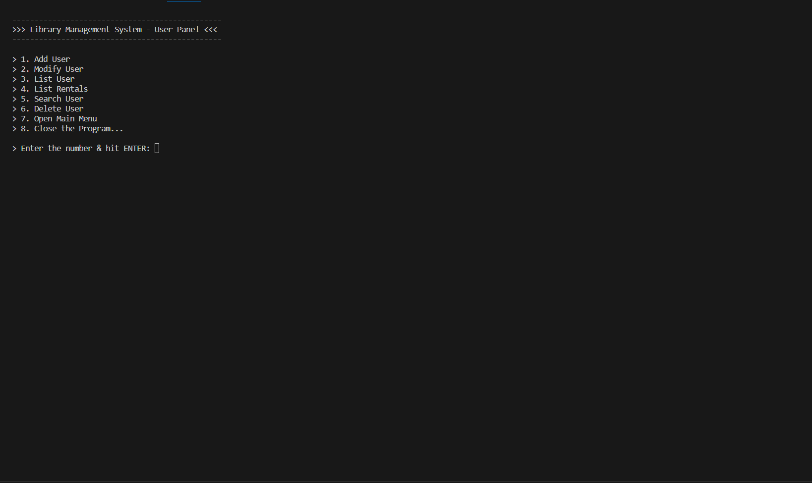
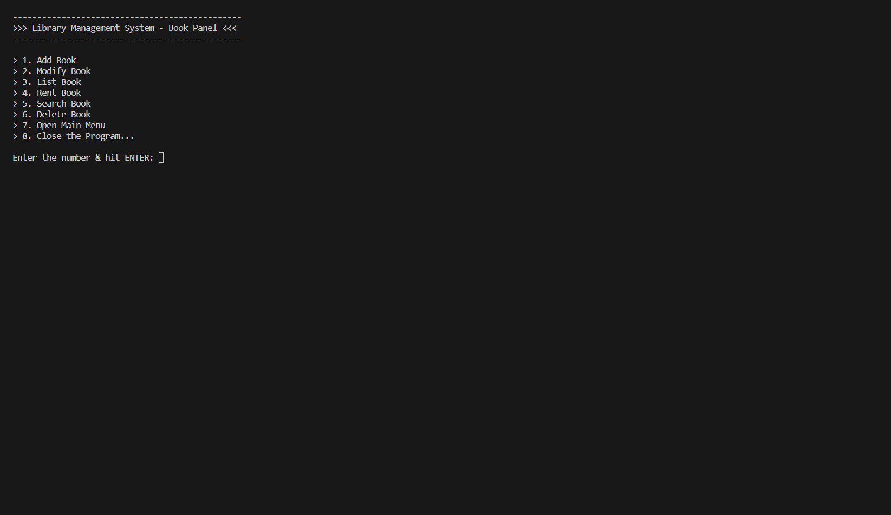
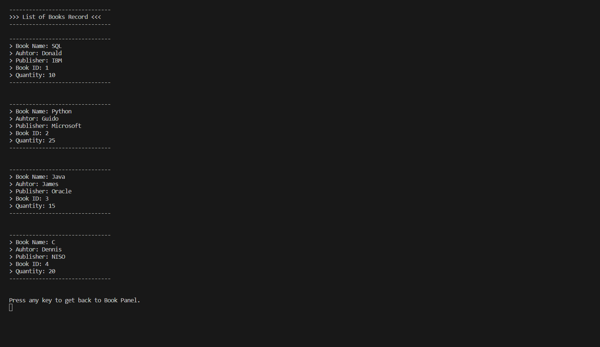
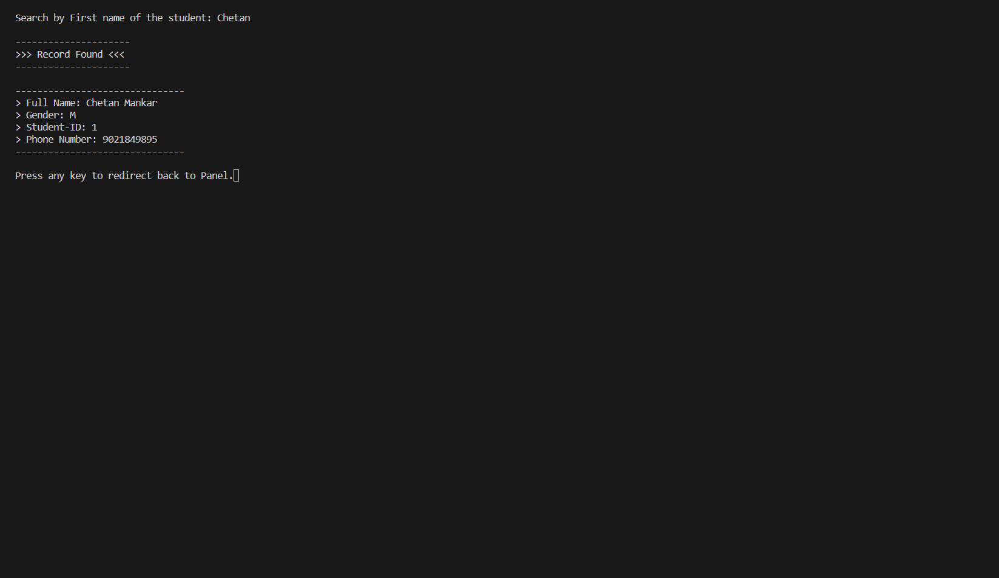
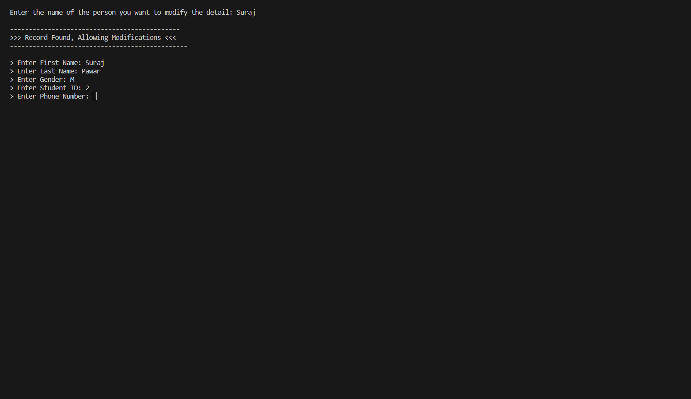
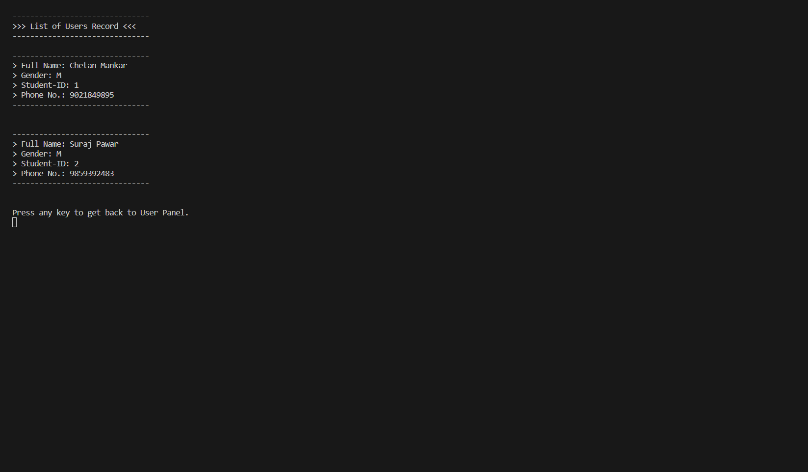

# Library-Management-System

**A Library Management System coded in C to improve understanding on the concepts on File management, record entry, modification, deletion.**

## Description

The concept of storing or recording the details of books embedded within the user's system is known as Library Management System. It details the type of books, the list of books, etc. Only a person with the login credentials can access the Library Management System. That person can perform many operations like adding the book details, removing the book details, displaying the book details, modifying the book details, etc.

Things you can do with this system

- Adding Users
- Adding Books
- Modifying Details  of Users
- Modifying Details of Books
- Searching specific USER from stored records
- Searching specific BOOK from stored records
- Serach the book by Author name or Book name
- Renting Books
- Listing all User records
- Listing all Book records
- Listing all Rented Book records
- Deleting User record
- Deleting Book record, etc.

## Password: "chetan360"

The Library Management System is secured with a layer of authentication password for protecting the files from unauthorized access of strangers. Enter the password and hit ENTER. The password will not be shown publicly, it will shown in ***** format. Read the comments in the code to better understand how it works!

## Requirements for using it

- A software (IDE) for reviewing the code
- C/C++ compiler (Recommended: GCC Compiler)
- Command Prompt or Windows Powershell

**Note**: This program won't run on online compilers as they don't provide libraries for FILE Management & external storing.

## Screenshots 🖼️

### 01. User Management Panel



### 02. Book Management Panel



### 03. List Book Rentals


### 04. Search Record



### 05. Record Modification



### 06. New Book Record



### 07. List Book Record


### 08. List User Record



## MIT LICENSE 📔

```LICENSE

MIT License

Copyright (c) 2022 Alkaison

Permission is hereby granted, free of charge, to any person obtaining a copy
of this software and associated documentation files (the "Software"), to deal
in the Software without restriction, including without limitation the rights
to use, copy, modify, merge, publish, distribute, sublicense, and/or sell
copies of the Software, and to permit persons to whom the Software is
furnished to do so, subject to the following conditions:

The above copyright notice and this permission notice shall be included in all
copies or substantial portions of the Software.

THE SOFTWARE IS PROVIDED "AS IS", WITHOUT WARRANTY OF ANY KIND, EXPRESS OR
IMPLIED, INCLUDING BUT NOT LIMITED TO THE WARRANTIES OF MERCHANTABILITY,
FITNESS FOR A PARTICULAR PURPOSE AND NONINFRINGEMENT. IN NO EVENT SHALL THE
AUTHORS OR COPYRIGHT HOLDERS BE LIABLE FOR ANY CLAIM, DAMAGES OR OTHER
LIABILITY, WHETHER IN AN ACTION OF CONTRACT, TORT OR OTHERWISE, ARISING FROM,
OUT OF OR IN CONNECTION WITH THE SOFTWARE OR THE USE OR OTHER DEALINGS IN THE
SOFTWARE.
```
